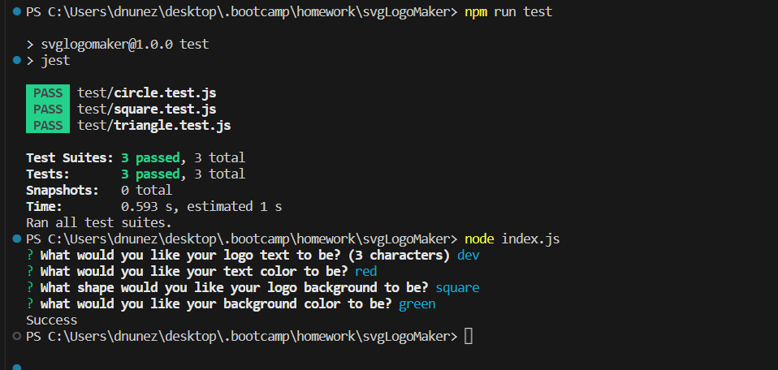

# README.MD File Generator

## Author

Devin Nunez

Email: devv-nunn@gmail.com
git: https://github.com/devv-nunn

## Description

In this project we will generate a svg file that will be a logo. We will be using classes and inquirer in order to generate our svg file  

Inquirer has two parts. Prompt in which we went over stores the questions and the answers. Next will be the .then will take the responses and push them to the correct file which will generate the text/shape of our logo and push that to a read/write function that would add to an svg file.

within the writefile function. their are two perameters. The name of the file you want to write to and the data.

the classes in lib are classes that generate both text and shapes. our circle, triangle, and square class inherit the color property from the shapes class this is because no matter what shape you choose they will all have the color you selected in the prompt. 

The text class will pass in the text and color from the index file and render the actual svg file and combines this text class with whatever shape class you choose so we can have a complete svg logo.

In this project we learned about the node library called inquirer and also I have learned about how classes function and how to pass data between the classes using inheritance. Along with the classes I have also learned how to put together a simple svg logo by learning different svg tags. 

## Table of Contents (Optional)

N/a

## Installation

- vs.code and node.js must be installed to use this applicationn

- Clone the following repository after installing vs.code and node.js and run index.html in integrated terminal.

## Usage

To use this application write "node index.js" this will start a series of questions in the command line which will then be used to fill dynamic areas of the read me file: name, title, discription etc...

After answering all the questions needed to generate the readme file you will notice a new readme file pop up in the file explorer. This is the Readme generated by our application.

## Videos Demonstrating application:

Table of contents showcase:
https://drive.google.com/file/d/1kshl7OMiItqJV28xPVHjw4GpBXaipAzi/view

application functionality showcase:
https://drive.google.com/file/d/16km-5pONA6Og9bzfQDNFYe9a5YQ4Qbtl/view

## Deployment

Repo: https://github.com/devv-nunn/ReadMeGenerator

# Tech Stack

HTML
CSS
JavaScript
node.js

## Credits

N/a

## License

MIT License.